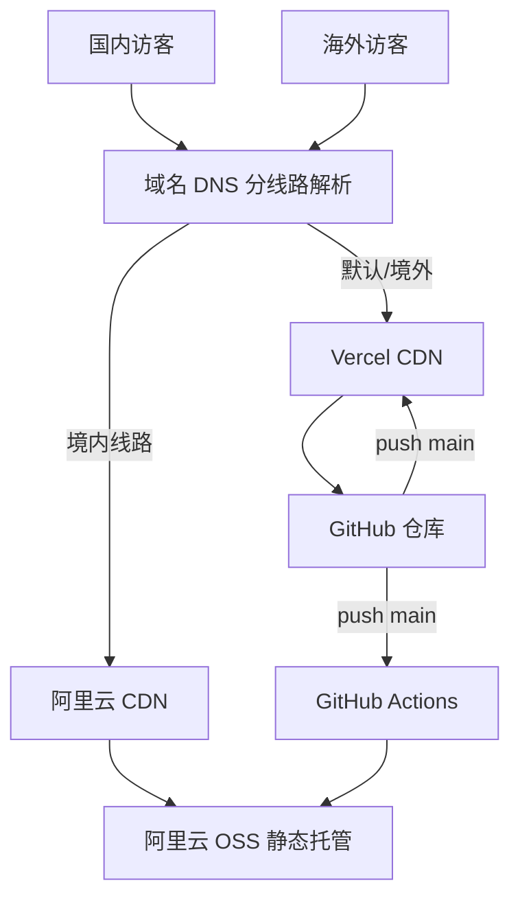

# 国内外双节点部署指南

让**国内用户不挂代理**、**海外用户**都能稳定访问同一套个人站。

## 架构



| 线路 | 托管 | 说明 |
|------|------|------|
| 海外 / 默认 | **Vercel**（已有） | `personal-site-ruddy-two.vercel.app` 或自定义域名 CNAME |
| 中国大陆 | **阿里云 OSS + CDN** | 需 **ICP 备案**，国内访问稳定 |

同一套代码：`git push` 后 Vercel 与 GitHub Actions 各构建一次，分别发布。

---

## 你需要准备

1. **一个域名**（推荐 `.com`，如 `wangyue.com`）
2. **阿里云账号**（实名认证）
3. **ICP 备案**（约 7–20 个工作日，必须本人操作）
4. **GitHub 仓库**（已有 [Dewyue/personal-site](https://github.com/Dewyue/personal-site)）

---

## 第一步：购买域名

在 **阿里云** 或 **腾讯云** 购买域名（便于后续备案一体办理）：

1. 登录 [阿里云域名注册](https://wanwang.aliyun.com/) 或腾讯云
2. 搜索并购买域名（如 `wangyue.com`）
3. 完成 **域名实名认证**（1–3 天）

> 备案用的域名必须在已实名的国内注册商名下。

---

## 第二步：ICP 备案（国内访问的前提）

没有备案，**无法**在国内 CDN 上合法绑定自定义域名，国内稳定性无从谈起。

### 阿里云备案简要流程

1. 登录 [阿里云 ICP 备案系统](https://beian.aliyun.com/)
2. 填写主体信息（个人：身份证、手机号、核验照片）
3. 填写网站信息（名称如「王悦个人网站」，不涉及新闻/论坛等）
4. 下载 **阿里云备案 APP** 完成人脸核验
5. 提交管局审核（各省 7–20 个工作日）
6. 备案号下发后，在网站页脚添加备案号链接（大陆法规要求）

备案期间网站可先只在 Vercel 海外访问；**备案通过后再开启国内 CDN + 分线路 DNS**。

---

## 第三步：海外节点（已完成）

当前 Vercel 项目：

- 仓库：`Dewyue/personal-site`
- 生产地址：https://personal-site-ruddy-two.vercel.app

绑定自定义域名（备案前后均可先在 Vercel 添加）：

1. Vercel 项目 → **Settings** → **Domains** → **Add**
2. 输入 `wangyue.com` 和 `www.wangyue.com`
3. 按提示在域名 DNS 添加记录（分线路配置见第六步）

---

## 第四步：阿里云 OSS 静态托管

备案通过后：

### 4.1 创建 Bucket

1. [阿里云 OSS 控制台](https://oss.console.aliyun.com/) → **创建 Bucket**
2. 建议：
   - **地域**：离访客近的，如「华东 1（杭州）」或「华东 2（上海）」
   - **读写权限**：公共读
   - **版本控制**：关
3. 记录 **Endpoint**，例如 `oss-cn-hangzhou.aliyuncs.com`

### 4.2 开启静态网站托管

1. Bucket → **基础设置** → **静态页面**
2. 默认首页：`index.html`
3. 默认 404：`404.html`（Astro 构建产物中有 `404.html`）

### 4.3 创建 RAM 子账号（给 GitHub Actions 用）

1. [RAM 控制台](https://ram.console.aliyun.com/) → 用户 → 创建用户
2. 勾选 **OpenAPI 访问**，保存 AccessKey ID / Secret
3. 授权策略：`AliyunOSSFullAccess`（或自定义仅该 Bucket 的读写策略）

### 4.4 绑定 CDN 加速（推荐）

1. [CDN 控制台](https://cdn.console.aliyun.com/) → 添加域名
2. **加速域名**：`wangyue.com`（需已备案）
3. **源站类型**：OSS 域名，选择刚创建的 Bucket
4. 开启 **HTTPS**（可申请免费证书或上传）
5. 缓存规则：HTML 短缓存（如 10 分钟），静态资源长缓存

---

## 第五步：GitHub Actions 自动部署国内节点

仓库已包含 [`.github/workflows/deploy-china.yml`](.github/workflows/deploy-china.yml)。

### 5.1 添加 Repository Secrets

GitHub 仓库 → **Settings** → **Secrets and variables** → **Actions** → **New repository secret**

| Secret 名称 | 示例值 | 说明 |
|-------------|--------|------|
| `ALIYUN_ACCESS_KEY_ID` | LTAI… | RAM 用户 AccessKey ID |
| `ALIYUN_ACCESS_KEY_SECRET` | … | RAM 用户 Secret |
| `ALIYUN_OSS_BUCKET` | `wangyue-site` | Bucket 名称 |
| `ALIYUN_OSS_ENDPOINT` | `oss-cn-hangzhou.aliyuncs.com` | Bucket 外网 Endpoint |
| `ALIYUN_CDN_DOMAIN` | `wangyue.com` | 可选，用于后续 CDN 刷新 |

### 5.2 启用工作流

GitHub 仓库 → **Settings** → **Secrets and variables** → **Actions** → **Variables** → **New repository variable**

| Variable | 值 |
|----------|-----|
| `CHINA_DEPLOY_ENABLED` | `true` |

保存后，每次 `push` 到 `main` 会：

1. `npm run build`
2. 将 `dist/` 同步到 OSS（`--delete` 删除旧文件）

也可手动触发：**Actions** → **Deploy China (Aliyun OSS)** → **Run workflow**。

---

## 第六步：DNS 分线路解析（关键）

在 **阿里云 DNS**（或购买域名处自带的 DNS）为 `wangyue.com` 配置：

| 主机记录 | 线路类型 | 记录类型 | 记录值 |
|----------|----------|----------|--------|
| `@` | **境内** | CNAME | CDN 分配的 CNAME（如 `wangyue.com.w.kunlunaq.com`） |
| `www` | **境内** | CNAME | 同上或 CDN 的 www CNAME |
| `@` | **默认** | A / CNAME | Vercel 提供的记录（见 Vercel Domains 页） |
| `www` | **默认** | CNAME | `cname.vercel-dns.com` |

效果：

- 国内 DNS 解析 → 阿里云 CDN → OSS（快、稳定）
- 海外 DNS 解析 → Vercel（快、稳定）

解析生效后，更新项目中的站点 URL（两处保持一致）：

- `astro.config.mjs` → `site: 'https://wangyue.com'`
- `src/data/site.ts` → `url: 'https://wangyue.com'`

然后 `git push`，让 sitemap / RSS / OG 链接指向正式域名。

---

## 第七步：页脚备案号（大陆合规）

备案通过后，在 [`src/components/layout/Footer.astro`](src/components/layout/Footer.astro) 页脚增加，例如：

```html
<a href="https://beian.miit.gov.cn/" target="_blank" rel="noopener">
  沪ICP备XXXXXXXX号
</a>
```

（替换为你的真实备案号。）

---

## 验证清单

| 检查项 | 国内（4G，关代理） | 海外 / VPN |
|--------|-------------------|------------|
| 首页 HTTPS | ✅ | ✅ |
| /about /projects /blog | ✅ | ✅ |
| 深色模式 | ✅ | ✅ |
| 备案号可见 | ✅ | — |

工具：[17ce.com](https://www.17ce.com/) 全国多节点测速。

---

## 费用粗算（年）

| 项目 | 约 |
|------|-----|
| 域名 `.com` | ¥60–90 |
| 阿里云 OSS（个人站流量） | ¥0–50（通常很低） |
| CDN 流量 | 有免费额度，个人站多数 ¥0–100 |
| Vercel | 免费 |
| **合计** | **约 ¥100–250/年** |

---

## 当前阶段你可以做什么

| 阶段 | 动作 |
|------|------|
| **现在** | 购买域名 → 提交备案 → Vercel 可先绑域名给海外用 |
| **备案通过** | 配 OSS + CDN → 填 GitHub Secrets → 开 `CHINA_DEPLOY_ENABLED` |
| **DNS 分线路生效** | 国内外均稳定 → 更新 `site` URL → 页脚加备案号 |

---

## 常见问题

**Q：不备案，只用 Cloudflare 行吗？**  
A：对**大陆**稳定性帮助有限，无法替代国内 CDN + 备案。

**Q：能否只用阿里云，不用 Vercel？**  
A：可以。阿里云 CDN 也有海外节点，但海外体验通常不如 Vercel；双部署是兼顾两边的常见做法。

**Q：GitHub Actions 失败？**  
A：检查 Secrets、Bucket 权限、Endpoint 是否带 `https://` 前缀（应**不要**带，只要 `oss-cn-xxx.aliyuncs.com`）。

---

更多 Vercel 单节点说明见 [DEPLOYMENT.md](./DEPLOYMENT.md)。
